# Real Estate Management System

## Overview
A Spring Boot web application for managing buildings, customers, contracts,
invoices, and transactions with role-based access control.

## Tech stack
- Back-end: Spring Boot, Spring Security (JWT), JPA, MySQL.
- Front-end: Thymeleaf, Bootstrap, Ajax, JavaScript.

## Features
- RBAC: Admin (full CRUD), Staff (assigned scope), Customer (view contracts & invoices).
- Authentication & Authorization: JWT-based auth with BCrypt password hashing, role-based access control; OAuth2 login  for third-party authentication.
- Contract management: separate flows for rental (with monthly invoice generation) and purchase (one-time sale per building).
- Invoice & billing: monthly invoices with utility meter tracking per rental contract; integrated VNPay API for mock payment processing.
- Dynamic filtering & pagination: multi-criteria search using JPA Specification with server-side pagination.
- Digital map: coordinate picker using Google Maps JS SDK, location autocomplete & geocoding via Google Places API; Haversine-based radius search for nearby buildings.
- Real-time chat: implemented using WebSockets for instant messaging between users.

## Database Design
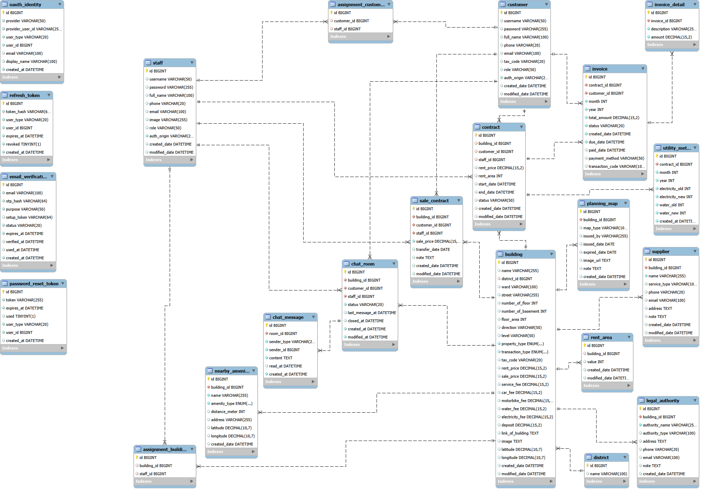

## Screenshots
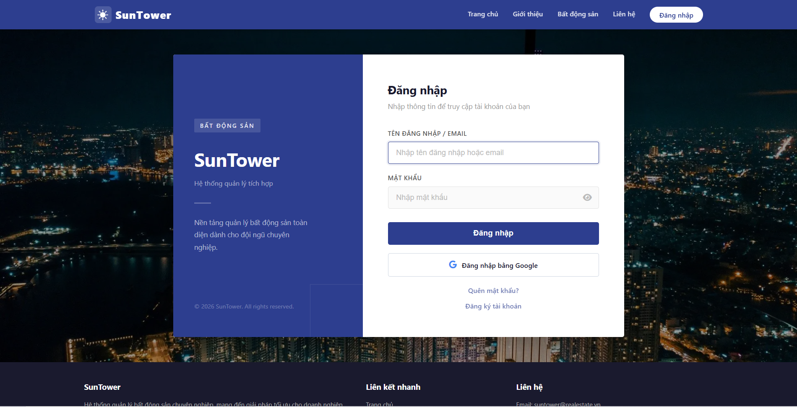

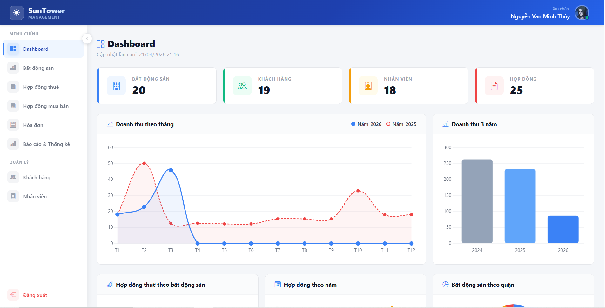

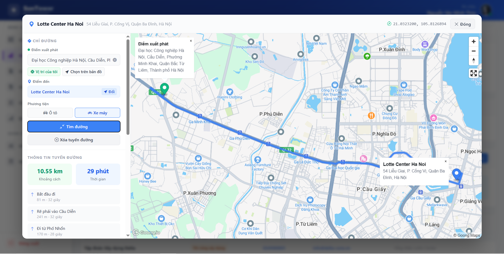

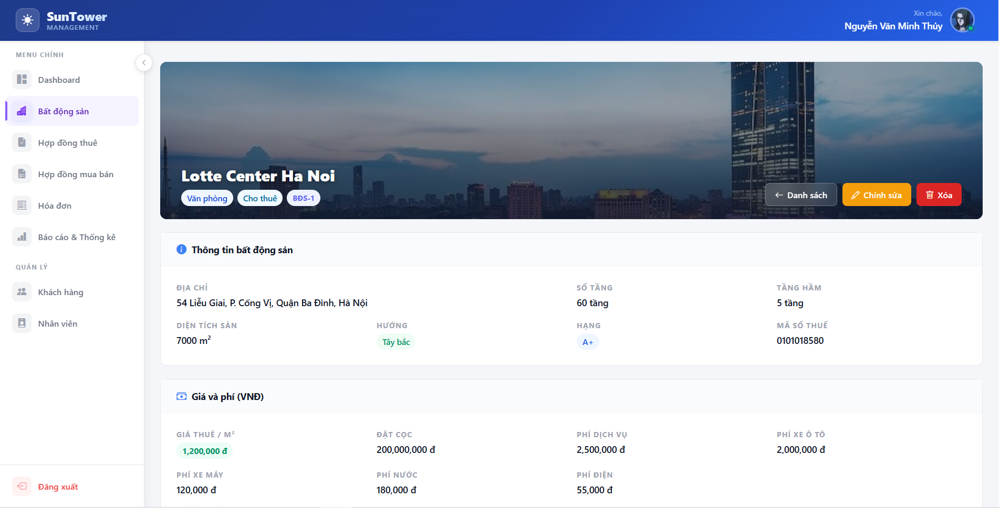

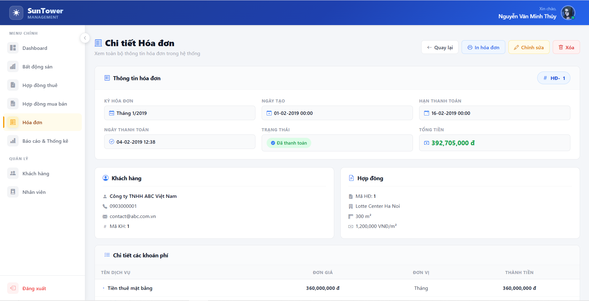

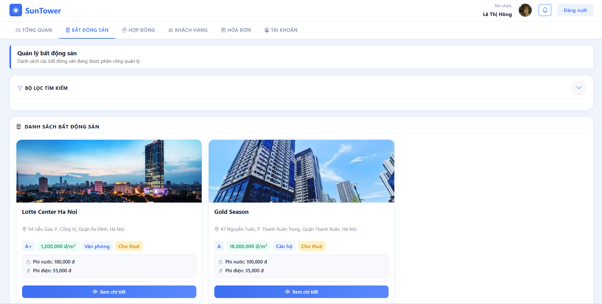

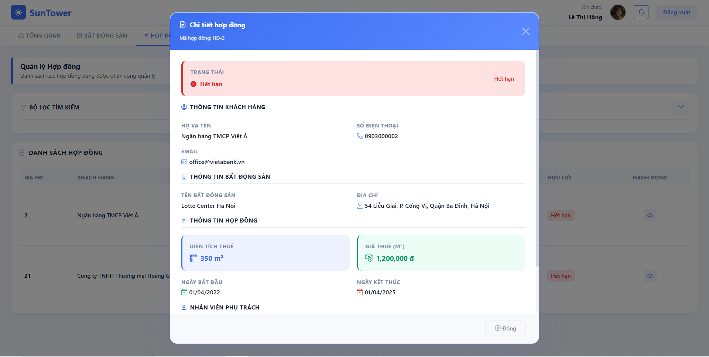

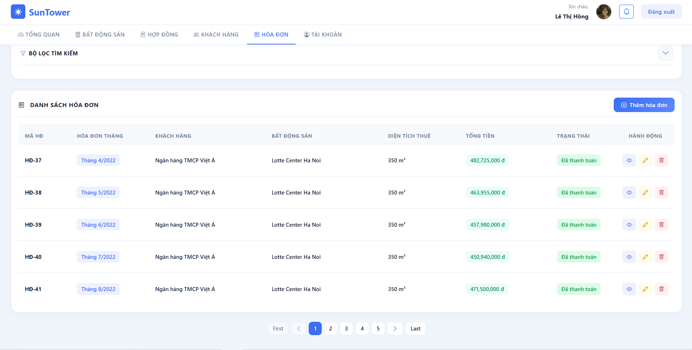

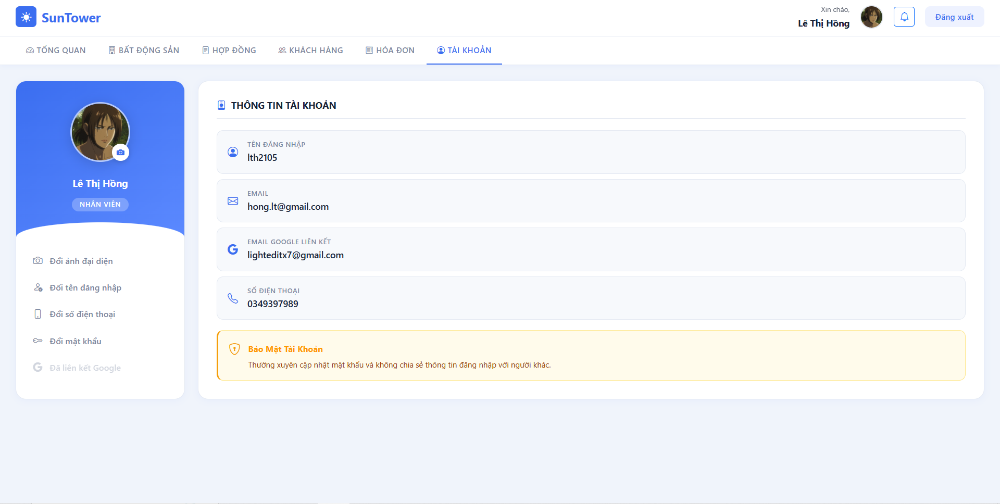

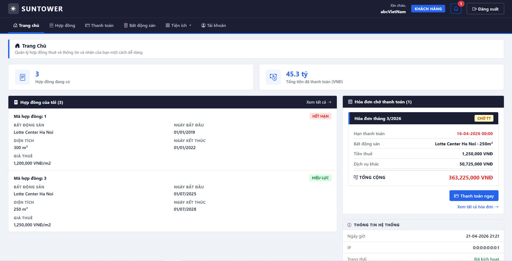

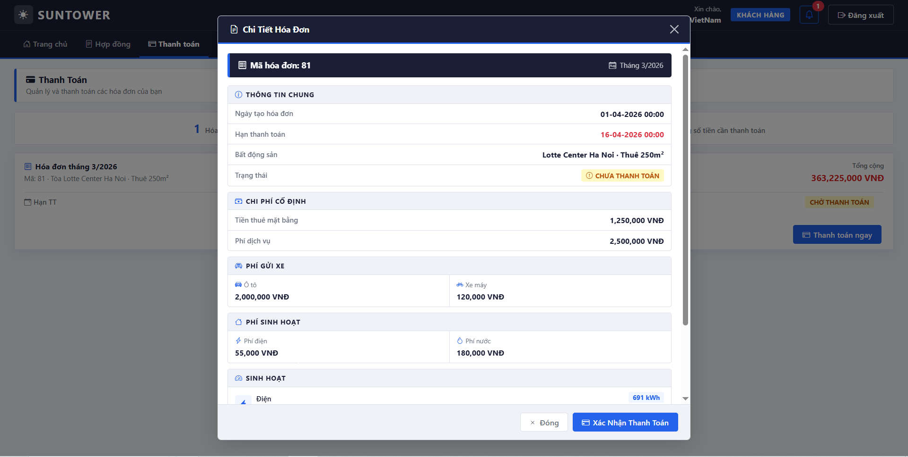

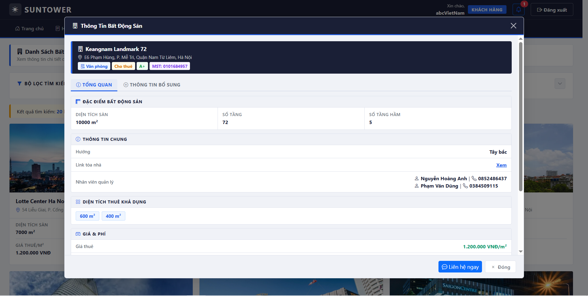

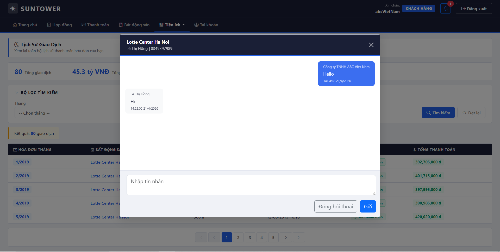

## How to Run
Read "guide.txt" file

## PROJECT IS FINISHED
